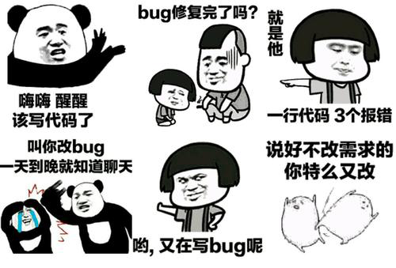

# Hey there :wave:

## About me 
hello everyone, I am Chinese, My name is Liu Kun, You can call me `Liu` and I am a web development engineer.

Welcome to exchange technology with me. :stuck_out_tongue:

## Things I am passionate about

- JavaScript :robot:
- VueJS :octocat:
- Webpack :octocat:
- Typescript :octocat:
- Node :octocat:

## Get in touch :coffee:

- Updating...

Visitor count 
  

<!--
**og-liu/og-liu** is a ✨ _special_ ✨ repository because its `README.md` (this file) appears on your GitHub profile.

Here are some ideas to get you started:

- 🔭 I’m currently working on ...
- 🌱 I’m currently learning ...
- 👯 I’m looking to collaborate on ...
- 🤔 I’m looking for help with ...
- 💬 Ask me about ...
- 📫 How to reach me: ...
- 😄 Pronouns: ...
- ⚡ Fun fact: ...
-->
